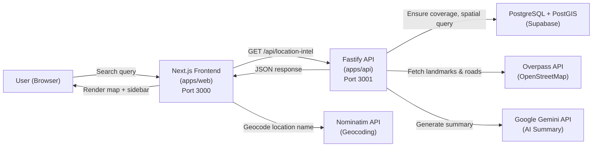
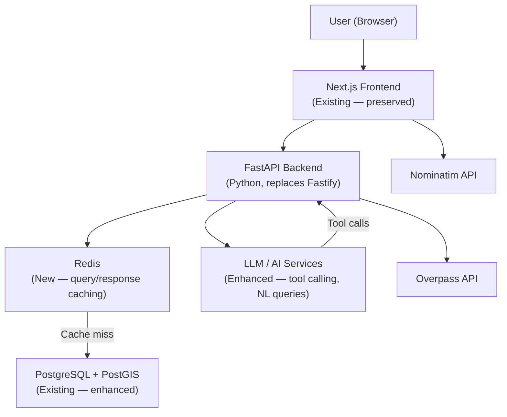

# PROJECT_EVOLUTION.md

> **Single source of truth** for the ongoing evolution of the Location Intelligence System.
> Updated after every major implementation phase.

---

## 1. Project Overview

### What the Application Does

The Location Intelligence System is a geospatial analytics dashboard that evaluates the **retail and commercial potential** of any geographic location. Given a set of coordinates or a location name, it:

1. Fetches nearby landmarks (restaurants, banks, hospitals, parks, commercial buildings, monuments, etc.) from the **Overpass API** (OpenStreetMap data).
2. Stores those landmarks in a **PostgreSQL/PostGIS** database with spatial geometry columns.
3. Classifies landmarks into three concentric **proximity zones** around the search center:
   - **Green Zone** (0–1.5 km)
   - **Yellow Zone** (1.5–3 km)
   - **Blue Zone** (3–4.5 km)
4. Queries road network data from Overpass to assess **connectivity**.
5. Generates a natural-language **retail summary** of the location's commercial viability using the **Google Gemini API**.
6. Presents everything on an interactive **Leaflet map** with a sidebar showing zone breakdowns and the AI summary.

### Primary Use Case

Retail site analysis — helping evaluate whether a location is viable for a commercial business by analyzing surrounding landmarks, footfall indicators, and road connectivity.

### Main User Workflows

1. **Search by location name** → Nominatim geocodes the name → backend fetches/returns intelligence data → map renders zones and landmarks.
2. **Search by coordinates** → same pipeline, but the geocoding step is skipped.
3. **Browse landmark details** → click markers on the map or items in the sidebar to inspect individual landmarks.
4. **Read AI summary** → Gemini-generated retail viability narrative displayed in the sidebar.

### Current Target Users

Individual analysts or developers exploring retail location intelligence. The application has no authentication or multi-tenancy — it is a single-user, personal project.

### Current Project Status

**Functional MVP.** The core pipeline (search → Overpass sourcing → PostGIS storage → spatial query → Gemini summary → map display) is working end-to-end. Deployed to Render (API) with Supabase-hosted PostgreSQL. The frontend runs locally or can be deployed separately.

---

## 2. Current Technology Stack

| Layer | Technology | Version | Purpose | Verified From |
|---|---|---|---|---|
| **Frontend Framework** | Next.js | 14.1.0 | React-based SSR/CSR framework | `apps/web/package.json` |
| **Frontend UI** | React | ^18 | Component rendering | `apps/web/package.json` |
| **Frontend Styling** | Tailwind CSS | ^3.3.0 | Utility-first CSS framework | `apps/web/package.json`, `tailwind.config.ts` |
| **Frontend Components** | shadcn/ui (Radix UI) | Various | Headless UI primitives (Dialog, ScrollArea, Slot, Tooltip) | `apps/web/components.json`, `apps/web/package.json` |
| **Frontend Icons** | Lucide React | ^0.330.0 | Icon library | `apps/web/package.json` |
| **Maps/Geospatial (Client)** | Leaflet + react-leaflet | ^1.9.4 / ^4.2.1 | Interactive map rendering, markers, zones | `apps/web/package.json` |
| **Backend Framework** | Fastify | ^4.26.1 | HTTP server framework | `apps/api/package.json` |
| **Backend CORS** | @fastify/cors | ^8.5.0 | Cross-origin request handling | `apps/api/package.json` |
| **Backend Language** | TypeScript | ^5.3.3 | Static typing | `apps/api/package.json` |
| **Backend Runtime** | tsx | ^4.21.0 | TypeScript execution without precompilation | `apps/api/package.json` |
| **Database** | PostgreSQL (Supabase-hosted) | Unknown | Primary data store | `.env`, `render.yaml` |
| **Database Extension** | PostGIS | Unknown | Spatial queries (ST_DWithin, ST_Distance, ST_MakePoint) | `schema.prisma`, SQL migrations |
| **ORM** | Prisma | ^5.10.2 | Schema management and query client | `packages/database/package.json` |
| **AI/LLM** | Google Gemini (@google/generative-ai) | ^0.24.1 | Natural-language location summary generation | `apps/api/package.json`, `gemini.service.ts` |
| **Geocoding** | Nominatim (OpenStreetMap) | N/A (external API) | Location name → coordinates | `apps/web/src/lib/api-client.ts` |
| **Geospatial Data** | Overpass API (OpenStreetMap) | N/A (external API) | Landmark and road network sourcing | `sourcing.service.ts` |
| **Web Scraping** | Playwright | ^1.42.1 | Template real-estate scraping (not actively used) | `apps/api/package.json`, `sourcing.service.ts` |
| **HTTP Client** | Axios | ^0.27.2 | Overpass API HTTP requests | `apps/api/package.json` |
| **Monorepo Tooling** | Turborepo | ^2.0.0 | Build orchestration across workspaces | `package.json`, `turbo.json` |
| **Package Manager** | npm | 10.8.1 | Dependency management | `package.json` (packageManager field) |
| **Code Formatting** | Prettier | ^3.0.0 | Code formatting | `package.json` |
| **Deployment** | Render | N/A | API hosting (Node.js web service) | `render.yaml` |
| **Database Hosting** | Supabase | N/A | Managed PostgreSQL with PostGIS | `.env`, `MIGRATION_GUIDE.md` |

---

## 3. Current Architecture

### Component Responsibilities

| Component | Responsibility |
|---|---|
| **Next.js Frontend** (`apps/web`) | Search UI, map rendering (Leaflet), sidebar with zone breakdown, API client, geocoding via Nominatim |
| **Fastify API** (`apps/api`) | Location intelligence endpoint, data sourcing orchestration, Overpass integration, Gemini AI summary, coverage management |
| **Prisma / Database Package** (`packages/database`) | Shared Prisma client singleton, schema definition, PostGIS geometry types, database connection management |
| **PostgreSQL + PostGIS** (Supabase) | Persistent storage of landmarks and coverage records, spatial indexing and distance calculations |
| **Overpass API** | Source of truth for OpenStreetMap landmark and road network data |
| **Nominatim API** | Forward geocoding (location name → lat/lng), called client-side |
| **Google Gemini API** | Generates natural-language retail viability summaries from landmark data |

---

## 4. Frontend

### Framework

- **Next.js 14.1.0** with the App Router (`src/app/` directory structure).
- React 18, TypeScript 5.
- Uses `'use client'` directives — the main page and all interactive components are client-side rendered.

### Routing

- Single page application: only the root route (`/`) exists in `src/app/page.tsx`.
- No additional routes or pages.

### Major Pages

| Page | File | Description |
|---|---|---|
| Home (only page) | `src/app/page.tsx` | Full-screen dashboard with search bar, map, sidebar, loading states, and debug info overlay |

### Important Components

| Component | File | Responsibility |
|---|---|---|
| `SearchBar` | `src/components/search/SearchBar.tsx` | Handles text input, coordinate parsing, and Nominatim geocoding |
| `Map` | `src/components/map/Map.tsx` | Leaflet MapContainer with tile layer, center marker, zone circles, and landmark markers (dynamically imported, SSR disabled) |
| `ZoneCircles` | `src/components/map/ZoneCircles.tsx` | Renders three concentric Leaflet circles (green/yellow/blue zones) |
| `LandmarkMarkers` | `src/components/map/LandmarkMarkers.tsx` | Renders color-coded Leaflet DivIcon markers with tooltip popups for each landmark |
| `Sidebar` | `src/components/sidebar/Sidebar.tsx` | Sheet-based sidebar with AI summary section and tabbed zone landmark lists |
| `ZoneLandmarkList` | `src/components/sidebar/ZoneLandmarkList.tsx` | Scrollable list of landmarks for a given zone with click-to-center behavior |
| `NoSSR` | `src/components/NoSSR.tsx` | Wrapper to disable server-side rendering (redundant with dynamic import, kept as safety net) |
| `MapContainer` | `src/components/map/MapContainer.tsx` | Alternative map wrapper component — **not currently used** (noted in file comments) |
| **UI Primitives** (shadcn/ui) | `src/components/ui/` | `alert`, `badge`, `button`, `input`, `scroll-area`, `sheet`, `tooltip` |

### State Management

- **React `useState` hooks** in `page.tsx` — no external state management library.
- State variables: `center`, `locationData`, `loading`, `loadingPhase`, `error`, `mapKey`.
- Loading phase timer (`useRef`) upgrades the loading message from "checking database" to "fetching live data" after 15 seconds.

### API Communication

- Custom `ApiClient` class in `src/lib/api-client.ts`.
- `getLocationIntel(lat, lng)` → `GET /api/location-intel?lat=...&lng=...` → Fastify backend.
- `geocodeLocation(name)` → Nominatim API (client-side, no backend proxy).
- API base URL configured via `NEXT_PUBLIC_API_URL` environment variable (defaults to `http://localhost:3001`).

### Authentication Handling

- **None.** No authentication exists on the frontend. No login page, no token management, no protected routes.

### Map Implementation

- **Leaflet** via `react-leaflet` with OpenStreetMap tile layer.
- Map is dynamically imported (`next/dynamic`) with SSR disabled to avoid `window` undefined errors.
- Custom `DivIcon` markers with category-based color coding (14 categories mapped to specific colors).
- Tooltip popups show landmark name, category badge, rating, hours, and distance.
- Zone circles rendered as Leaflet `Circle` components with configurable radii (1500m, 3000m, 4500m).
- Default marker icon fix applied via CDN URLs.

### Important UI Flows

1. **Empty state** → "Get Started" overlay displayed center-screen.
2. **Search initiated** → Loading overlay with spinner and phase-specific messaging.
3. **Data loaded** → Map re-renders with `key` prop change, sidebar becomes available.
4. **Error state** → Destructive alert displayed below the header.
5. **Debug overlay** → Always visible in bottom-right, showing center coordinates, data source, and zone counts.

### Error/Loading Handling

- Loading: Full-screen overlay with `Loader2` spinner. Two phases: "Checking database…" (instant) and "Fetching live data from OpenStreetMap…" (after 15s timeout).
- Errors: Displayed as `Alert` component with `destructive` variant.
- API errors caught in `try/catch` and set to error state.
- Search errors use `alert()` (browser native) — no custom error UI for search failures.

---

## 5. Backend

### Backend Framework

**Fastify 4.26.1** (TypeScript, ESM modules).

### Entry Point

`apps/api/src/index.ts` — creates Fastify server, registers CORS, defines routes, starts listening on port 3001.

### API Routes

| Method | Endpoint | Purpose | Authentication | Implementation |
|---|---|---|---|---|
| `GET` | `/health` | Health check | None | Inline handler in `index.ts` — returns `{ status: 'ok', timestamp }` |
| `GET` | `/api/location-intel` | Main location intelligence endpoint | None | `MapController.getLocationIntel` |
| `POST` | `/sourcing/fetch` | Manual data sourcing trigger | None | Inline handler in `index.ts` — Overpass fetch + optional scraping + DB save |

### Controllers/Handlers

| Controller | File | Methods |
|---|---|---|
| `MapController` | `src/controllers/map.controller.ts` | `getLocationIntel(req, reply)` — static method |

### Services

| Service | File | Responsibility |
|---|---|---|
| `SourcingService` | `src/services/sourcing.service.ts` | Overpass API queries (landmarks + roads), data sanitization, Playwright scraping (template), DB upsert |
| `GeminiService` | `src/services/gemini.service.ts` | Gemini API integration with model fallback chain, generates retail location summaries |
| `CoverageService` | `src/services/coverage.service.ts` | Ensures landmark data exists for a search area before spatial queries run; manages LocationCoverage table |

### Business Logic

The main intelligence pipeline in `MapController.getLocationIntel`:

1. **Coverage check** (`CoverageService.ensureCoverage`) — checks if the area has been indexed. If not, fetches from Overpass, cleans data, saves to DB, records coverage.
2. **Spatial query** — raw PostGIS SQL: `ST_DWithin` + `ST_Distance` within 4500m radius.
3. **Zone classification** — landmarks split into green (≤1500m), yellow (1500–3000m), blue (3000–4500m).
4. **Road network** — separate Overpass query for nearby highways and U-turn restrictions.
5. **AI summary** — Gemini generates a 2-sentence retail viability summary.
6. **Response** — zones, connectivity, summary, and debug timing data returned as JSON.

### Database Access

- All database access via the shared `prisma` singleton from `@packages/database`.
- Raw SQL (`$queryRaw`, `$executeRaw`) used extensively for PostGIS spatial functions.
- Prisma ORM methods not used for spatial queries — only for coverage record lookups via raw SQL.

### Authentication

- **None.** No authentication middleware, no API keys required for endpoints, no user sessions.
- Supabase RLS policies exist at the database level (public read, authenticated full access), but the API server connects with the direct database URL, bypassing Supabase's auth layer.

### Validation

- Basic parameter validation: `lat`/`lng` presence and `parseFloat` NaN checks in `MapController`.
- `POST /sourcing/fetch` checks for required `lat`/`lon` fields.
- No schema validation library (no Zod, Joi, or Fastify schemas).
- No input sanitization beyond what Prisma's parameterized queries provide.

### Error Handling

- Try/catch blocks in controller and services.
- Prisma error codes and meta logged to console.
- Generic 500 response with error message; stack trace included only in development.
- Gemini service: model fallback chain (8 models tried sequentially); errors logged to `gemini-error.log` file.
- Sourcing service: individual landmark save failures logged to `sourcing.log`; processing continues.

### External Integrations

| Integration | Library | Purpose |
|---|---|---|
| **Overpass API** | Axios | Landmark and road network data. 4 endpoint fallbacks with 3s delay between retries. |
| **Google Gemini** | @google/generative-ai | AI-generated retail summaries. 8-model fallback chain. |
| **Playwright** | playwright | Real estate scraping template — present in code but not actively integrated into the main pipeline. |

---

## 6. Database

### Database Technology

- **PostgreSQL** hosted on **Supabase** (AWS ap-south-1 region).
- **PostGIS** extension enabled for spatial geometry support.
- Accessed via session pooler (port 5432).

### Tables

| Table | Purpose | Key Columns |
|---|---|---|
| `Location` | Generic location records with spatial position | `id` (UUID, PK), `position` (geometry), `createdAt`, `updatedAt` |
| `Landmark` | Points of interest sourced from Overpass | `id` (UUID, PK), `name`, `category`, `hours` (JSON), `rating` (Float), `position` (geometry), `createdAt`, `updatedAt` |
| `LocationCoverage` | Tracks which areas have been indexed from Overpass | `id` (Text, PK), `centerLat`, `centerLng`, `radiusM` (default 4500), `fetchedAt` |
| `spatial_ref_sys` | PostGIS internal — spatial reference system definitions | `srid` (PK), `auth_name`, `auth_srid`, `srtext`, `proj4text` |

### Relationships

- **No foreign keys** between application tables. `Location`, `Landmark`, and `LocationCoverage` are independent.
- `spatial_ref_sys` is a PostGIS system table, not application-managed.

### Important Columns

| Column | Table | Type | Notes |
|---|---|---|---|
| `position` | Location, Landmark | `geometry` (PostGIS, SRID 4326) | Stored as WGS84 points. Queried via `ST_DWithin`, `ST_Distance`, `ST_AsGeoJSON`. Declared as `Unsupported("geometry")` in Prisma. |
| `hours` | Landmark | `Json` (jsonb) | Stores `{ opening_hours: "..." }` from OpenStreetMap data |
| `name`, `category` | Landmark | `String` | Compound unique constraint: `@@unique([name, category])` |
| `radiusM` | LocationCoverage | `Int` | Default 4500 meters |

### Indexes and Constraints

- `Landmark.id` — primary key (UUID).
- `Landmark(name, category)` — unique constraint (`Landmark_name_category_key`). Used for upsert ON CONFLICT.
- `LocationCoverage.id` — primary key (text/UUID).
- **No spatial index** (GiST) explicitly created on `Landmark.position` or `Location.position`. PostGIS `ST_DWithin` queries rely on sequential scans unless a GiST index was auto-created by Supabase.

### Migrations

Migrations are **manual SQL files** run via Supabase SQL Editor or `psql` — not managed by Prisma Migrate:

| Migration | File | What It Does |
|---|---|---|
| `001_init_postgis_rls.sql` | PostGIS extension + RLS policies (public read, authenticated full access) on Location and Landmark tables |
| `002_coverage_and_unique_index.sql` | `Landmark(name, category)` unique constraint + `LocationCoverage` table creation + RLS policies for coverage table |

Schema changes are pushed via `prisma db push` (not `prisma migrate`).

### Geospatial Functionality

- **PostGIS functions used:** `ST_DWithin`, `ST_Distance`, `ST_SetSRID`, `ST_MakePoint`, `ST_GeomFromText`, `ST_AsGeoJSON`.
- All spatial queries use `::geography` cast for meter-based distance calculations.
- Coordinate system: WGS84 (SRID 4326).

### Important Queries

1. **Coverage check** (`coverage.service.ts`): `ST_DWithin` on `LocationCoverage` centers vs. search point within 4500m.
2. **Legacy coverage backfill** (`coverage.service.ts`): Checks if ≥10 landmarks exist within 4500m; if so, inserts a coverage record.
3. **Main spatial query** (`map.controller.ts`): `ST_DWithin` + `ST_Distance` on `Landmark` table within 4500m, returns GeoJSON position.
4. **Landmark upsert** (`sourcing.service.ts`): `INSERT ... ON CONFLICT (name, category) DO UPDATE SET ...` — parameterized raw SQL.

### Potential Performance Concerns

- **Missing spatial (GiST) index** on `Landmark.position` — spatial queries will do sequential scans as the landmark count grows.
- **One-at-a-time upserts** in `saveLandmarks()` — each landmark is a separate `$executeRaw` call instead of a batch operation.
- **No connection pooling configuration** beyond Supabase's default session pooler.
- **LocationCoverage lookups** compute `ST_DWithin` on the fly — no spatial index on coverage center points.
- **`Location` table** appears unused by any application code (only used in the verification script).

---

## 7. Existing Features

### Implemented

- [x] Location search by name (via Nominatim geocoding, client-side)
- [x] Location search by coordinates (parsed in SearchBar component)
- [x] Overpass API landmark sourcing (restaurants, cafes, hospitals, banks, parks, monuments, etc.)
- [x] Overpass API road network sourcing (highways + U-turn restrictions)
- [x] Data sanitization/cleaning of Overpass responses
- [x] Landmark upsert to PostgreSQL with deduplication (ON CONFLICT)
- [x] PostGIS spatial queries (ST_DWithin, ST_Distance)
- [x] Three-zone proximity classification (green/yellow/blue)
- [x] Coverage tracking (LocationCoverage table to avoid redundant Overpass calls)
- [x] Legacy coverage backfill (auto-create coverage records for pre-existing landmark data)
- [x] Google Gemini AI retail summary generation (with 8-model fallback chain)
- [x] Interactive Leaflet map with OpenStreetMap tiles
- [x] Color-coded landmark markers with category-based colors (14 categories)
- [x] Concentric zone circle visualization on map
- [x] Sidebar with zone tabs and scrollable landmark list
- [x] Click-to-center behavior (clicking a landmark in sidebar or map centers the map)
- [x] Loading state with two-phase messaging (checking DB → fetching live)
- [x] Error display (Alert component)
- [x] Debug info overlay (coordinates, zone counts, data source, timing)
- [x] CORS configuration for frontend requests
- [x] Row Level Security policies on database tables
- [x] Render deployment configuration (API)
- [x] Overpass endpoint fallback (4 endpoints with retry)
- [x] In-memory caching of Overpass and road network responses
- [x] Monorepo structure with Turborepo

### Not Implemented / Planned

- [ ] User authentication / login
- [ ] Natural-language location search (e.g., "find me a good spot for a cafe near Bangalore")
- [ ] LLM-based tool calling / agentic queries
- [ ] Redis caching layer
- [ ] Persistent server-side caching (current caching is in-memory, lost on restart)
- [ ] Frontend deployment configuration
- [ ] Docker containerization
- [ ] Automated tests (unit, integration, e2e)
- [ ] Rate limiting on API endpoints
- [ ] Input validation with schema library (Zod/Joi)
- [ ] Spatial (GiST) database index
- [ ] Batch landmark insertion
- [ ] Location history / saved searches
- [ ] Multi-user support
- [ ] Dark mode toggle (CSS variables defined but no toggle UI)
- [ ] Real estate scraping integration (Playwright code exists but is not connected to the main pipeline)
- [ ] Custom map tile layers or styling
- [ ] API documentation (Swagger/OpenAPI)
- [ ] CI/CD pipeline
- [ ] Health check monitoring / alerting
- [ ] Environment variable validation
- [ ] Structured logging

---

## 8. Current Strengths

### 1. Well-Structured Monorepo
The Turborepo workspace cleanly separates `apps/api`, `apps/web`, and `packages/database`. The shared `@packages/database` package correctly provides a singleton Prisma client reusable across backend and (potentially) frontend.

### 2. PostGIS Spatial Pipeline
Real PostGIS spatial queries (`ST_DWithin`, `ST_Distance`, `ST_AsGeoJSON`) are used — not application-level distance calculations. This is the right approach for geospatial accuracy and performance at scale.

### 3. Coverage Tracking System
The `LocationCoverage` table and `CoverageService` prevent redundant Overpass API calls. The backwards-compatibility check (auto-backfilling coverage records for pre-existing data) is a thoughtful design.

### 4. Overpass Endpoint Resilience
Four Overpass API endpoints with sequential fallback and delay between retries. This significantly reduces the chance of complete failure due to rate limiting.

### 5. Gemini Model Fallback Chain
The Gemini service tries 8 model variants sequentially, handling deprecation and availability issues gracefully. If all models fail, a sensible fallback summary is returned.

### 6. Clean Component Architecture
Frontend components are well-separated by domain (map/, search/, sidebar/, ui/). shadcn/ui provides a consistent, accessible component library. TypeScript interfaces (`Landmark`, `ZoneData`, `LocationIntelResponse`) are clean and well-defined.

### 7. Parameterized SQL Queries
All raw SQL uses Prisma's tagged template literals (`$queryRaw`, `$executeRaw`), which are parameterized — preventing SQL injection even in raw PostGIS queries.

### 8. GeoJSON Data Flow
The API returns landmark positions as GeoJSON (`ST_AsGeoJSON`), and the frontend correctly interprets `[longitude, latitude]` coordinate order.

### 9. Existing Deployment Configuration
`render.yaml` provides infrastructure-as-code for the API deployment, including environment variable references.

---

## 9. Current Weaknesses / Technical Debt

### 9.1. Exposed Secrets in Repository

**Problem:** Database credentials and API keys are committed to `.env` files checked into the repository (root `.env`, `packages/database/.env`). The `.gitignore` includes `.env` but the files are present in the working tree and may have been committed previously.

**Impact:** Anyone with repository access has full database credentials and the Gemini API key.

**Suggested direction:** Rotate all credentials immediately. Ensure `.env` files are never committed. Use environment variables injected at deployment time.

---

### 9.2. No Authentication

**Problem:** All API endpoints are publicly accessible with no authentication. The `POST /sourcing/fetch` endpoint can trigger expensive Overpass API calls and write to the database.

**Impact:** Abuse risk — anyone can exhaust Overpass rate limits or fill the database with junk data.

**Suggested direction:** Add at minimum API key authentication for write endpoints. Consider full user authentication if multi-tenancy is planned.

---

### 9.3. Missing Spatial (GiST) Index

**Problem:** No GiST index exists on `Landmark.position`. All `ST_DWithin` queries perform sequential scans.

**Impact:** Query performance degrades linearly as the Landmark table grows.

**Suggested direction:** Add `CREATE INDEX idx_landmark_position ON "Landmark" USING GIST (position);`.

---

### 9.4. No Automated Tests

**Problem:** Zero test files. No test framework configured. Multiple ad-hoc `test-*.ts` scripts exist in `apps/api/` and `packages/database/src/` but these are manual verification scripts, not automated tests.

**Impact:** No regression protection. Refactoring or migrations carry high risk.

**Suggested direction:** Add test framework (Vitest or Jest for frontend, pytest if migrating to FastAPI). Prioritize testing the spatial query pipeline and Overpass data sanitization.

---

### 9.5. No Input Validation Library

**Problem:** Request validation is manual (`if (!lat || !lng)`). No schema validation (Zod, Joi, or Fastify schema definitions).

**Impact:** Silent failures on malformed input. No structured error responses. No documentation of expected request/response shapes.

**Suggested direction:** Use Fastify's built-in JSON Schema validation or add Zod. Define request/response schemas for all endpoints.

---

### 9.6. Single-Record Upserts in saveLandmarks()

**Problem:** Each landmark is inserted with a separate `$executeRaw` call in a `for` loop. For 100+ landmarks, this means 100+ round trips to the database.

**Impact:** Slow data ingestion. A single Overpass response can contain hundreds of elements.

**Suggested direction:** Batch inserts using a single `INSERT ... VALUES (...), (...), ...` statement or use a transaction with prepared statements.

---

### 9.7. In-Memory Caching Only

**Problem:** `overpassCache` and `roadNetworkCache` are `Map` objects in process memory. They are lost on every server restart or redeployment.

**Impact:** After deployment, the first request for any location re-fetches from Overpass even if the data exists in the database (the CoverageService mitigates this, but the Overpass/road caches still reset).

**Suggested direction:** The database-backed coverage system already handles the critical case. For road network data and other transient caches, consider Redis or accept the current behavior.

---

### 9.8. Unused Code

**Problem:** Several files serve no active purpose:
- `MapContainer.tsx` — explicitly commented as "not used anywhere."
- `apps/api/test-*.ts`, `apps/api/check-*.ts` — manual test scripts in the project root (not in a test directory).
- `Location` table — never queried by any application endpoint (only by verification script).
- `Playwright` scraping code — present but not integrated into the main pipeline.

**Impact:** Code clutter. Confusing for new contributors. Dead code may mislead future development.

**Suggested direction:** Remove or archive unused files. If the `Location` table has a planned use, document it; otherwise, consider removing it.

---

### 9.9. Hardcoded Default Rating

**Problem:** `sanitizeOverpassData()` assigns `rating: 4.0` to all landmarks regardless of actual data.

**Impact:** Misleading data. All landmarks appear equally rated.

**Suggested direction:** If OpenStreetMap data doesn't include ratings, omit the field or clearly mark it as unknown rather than defaulting to a specific value.

---

### 9.10. Browser `alert()` for Errors

**Problem:** The `SearchBar` component uses `alert()` for error messages ("Location not found", "Invalid coordinates", "Search failed").

**Impact:** Poor UX. Blocks the UI thread. Inconsistent with the `Alert` component used elsewhere.

**Suggested direction:** Use the existing error state pattern or toast notifications.

---

### 9.11. No Rate Limiting

**Problem:** No rate limiting on any endpoint. The `/sourcing/fetch` endpoint triggers expensive external API calls.

**Impact:** Vulnerable to abuse and accidental overuse.

**Suggested direction:** Add Fastify rate limiting plugin (`@fastify/rate-limit`).

---

### 9.12. GEMINI_API_KEY in Database Package

**Problem:** The `packages/database/.env` file contains `GEMINI_API_KEY` with a comment "DOUBT - why gemini api key is required in this env file?" — the developer themselves noted this is incorrect.

**Impact:** Unnecessary secret exposure. Confusing configuration.

**Suggested direction:** Remove `GEMINI_API_KEY` from the database package's `.env`. It should only exist in the API's environment.

---

### 9.13. Inconsistent Zone Label Naming

**Problem:** The sidebar labels zones as "Green Zone (0-5km)", "Yellow Zone (5-10km)", "Blue Zone (10-15km)" but the actual zone radii are 0-1.5km, 1.5-3km, 3-4.5km (verified from `ZoneCircles.tsx` and `map.controller.ts`).

**Impact:** Users see incorrect distance labels. Misleading UI.

**Suggested direction:** Update sidebar labels to match actual zone radii: "Green Zone (0–1.5km)", "Yellow Zone (1.5–3km)", "Blue Zone (3–4.5km)".

---

## 10. Target Architecture

The planned evolution targets a modern full-stack architecture with AI capabilities:

### Evolution Strategy

The current architecture can evolve toward this target incrementally:

1. **Frontend** — preserved as-is. Next.js 14 is already a modern framework. API client changes only need URL/payload updates if the FastAPI backend maintains compatible endpoints.

2. **Backend** — Fastify (Node.js/TypeScript) replaced with FastAPI (Python). The Overpass integration, data sanitization, coverage logic, and Gemini service are all re-implemented in Python. The PostGIS spatial queries translate directly since they are raw SQL.

3. **Database** — PostgreSQL/PostGIS is already the target. Add spatial indexes, consider schema refinements, add Alembic for migration management.

4. **Cache** — Redis added as an intermediate layer between API and DB for frequently requested locations. Can also cache Gemini summaries.

5. **AI** — Evolve from simple summary generation to tool-calling patterns where the LLM can invoke structured queries (e.g., "find the nearest hospital in the green zone"). Requires careful guardrails.

---

## 11. Planned Technology Evolution

| Technology | Current State | Target State | Why |
|---|---|---|---|
| **Frontend** | Next.js 14.1.0 | Next.js (preserved/upgraded) | Already modern. No compelling reason to rewrite. |
| **Backend** | Fastify 4.26 (TypeScript/Node.js) | FastAPI (Python) | Python ecosystem for geospatial (Shapely, GeoPandas), native async, Pydantic validation, better LLM library ecosystem (LangChain, etc.), OpenAPI docs auto-generated. |
| **Database** | PostgreSQL + PostGIS (Supabase) | PostgreSQL + PostGIS (potentially self-hosted or kept on Supabase) | Already at target. Add indexes and proper migrations. |
| **ORM** | Prisma (TypeScript) | SQLAlchemy + GeoAlchemy2 (Python) | Native PostGIS type support via GeoAlchemy2. Prisma's `Unsupported("geometry")` requires raw SQL for all spatial operations — SQLAlchemy integrates natively. |
| **Migrations** | Manual SQL files + `prisma db push` | Alembic | Versioned, reversible migrations with Python migration scripts. Integrates with SQLAlchemy models. |
| **Cache** | In-memory `Map` objects (process-level) | Redis | Persistent across restarts. Shared across multiple API instances. TTL-based expiration. Sub-millisecond lookups. |
| **AI/LLM** | Google Gemini (simple prompt → text) | LLM + tool calling / structured output | Enable natural-language queries that invoke spatial functions. Validated structured output instead of free-text generation. |
| **Validation** | Manual `if` checks | Pydantic (FastAPI native) | Auto-validation, serialization, OpenAPI schema generation. Compile-time type safety. |
| **Testing** | None | pytest + Vitest | pytest for backend (fixtures, parametrized spatial tests). Vitest or existing Jest for frontend. |
| **Containerization** | None | Docker + docker-compose | Reproducible environments. Local dev parity. PostgreSQL/PostGIS + Redis in containers. |

---

## 12. Gap Analysis

| Area | Current | Target | Gap | Priority |
|---|---|---|---|---|
| **Backend Framework** | Fastify (Node.js/TS) | FastAPI (Python) | Complete rewrite of API layer. All services, controllers, and routes must be re-implemented. | **High** |
| **Backend Validation** | Manual if-checks | Pydantic schemas | No structured validation exists. Need to define request/response models. | **High** |
| **ORM / DB Access** | Prisma + raw SQL | SQLAlchemy + GeoAlchemy2 | Prisma schema → SQLAlchemy models. All raw PostGIS queries → GeoAlchemy2 expressions or raw SQL. | **High** |
| **Migrations** | Manual SQL + `prisma db push` | Alembic | Need to create initial Alembic migration matching current schema, then manage future changes. | **Medium** |
| **Caching** | In-memory Maps | Redis | No Redis infrastructure. Need Redis instance + integration layer. | **Medium** |
| **AI/LLM** | Simple Gemini prompt | LLM + tool calling | Current Gemini service is basic prompt→text. Tool calling requires structured function definitions, output parsing, guardrails. | **Medium** |
| **Spatial Indexes** | None | GiST on geometry columns | Missing index creation. One SQL command per table. | **Critical** |
| **Testing** | Zero tests | pytest + Vitest | No test infrastructure. Need framework setup, fixtures, and initial test coverage. | **High** |
| **Containerization** | None | Docker + docker-compose | No Dockerfiles, no compose config. Need multi-service setup (API, Redis, optionally PostgreSQL). | **Low** |
| **API Documentation** | None | Auto-generated OpenAPI (FastAPI) | FastAPI provides this automatically with Pydantic models. | **Low** (comes free with FastAPI) |
| **CI/CD** | None | GitHub Actions or similar | No pipeline. Need build, test, lint, deploy steps. | **Low** |
| **Secret Management** | .env files (some committed) | Environment variables / secrets manager | Credentials exposed in repository. | **Critical** |
| **Rate Limiting** | None | FastAPI middleware or API gateway | No protection against abuse. | **Medium** |
| **Structured Logging** | `console.log` / `console.error` | Python `logging` + structured output | Inconsistent log format. No log levels. | **Low** |

---

## 13. Implementation Roadmap

### Phase 1 — Repository Understanding

**Status:** `Completed`

**Objective:** Understand the entire existing codebase, document all functionality, identify strengths and weaknesses.

**Expected changes:** `PROJECT_EVOLUTION.md` created. No code changes.

**Dependencies:** None.

**Risks:** None.

**Acceptance criteria:**
- [x] All source files inspected.
- [x] Technology stack documented with version evidence.
- [x] Architecture diagram created.
- [x] Feature checklist created with implemented/planned distinction.
- [x] Weaknesses and technical debt identified.
- [x] Gap analysis completed.

---

### Phase 2 — Architecture & Migration Design

**Status:** `Planned`

**Objective:** Design the FastAPI backend architecture, define SQLAlchemy models, plan the migration strategy from Fastify to FastAPI while keeping the frontend and database intact.

**Expected changes:**
- FastAPI project structure design document.
- SQLAlchemy model definitions matching current Prisma schema.
- Alembic initial migration plan.
- API endpoint parity mapping (Fastify routes → FastAPI routes).
- Decision on deployment strategy (parallel run vs. cutover).

**Dependencies:** Phase 1 completed.

**Risks:**
- SQLAlchemy/GeoAlchemy2 model mismatch with existing PostGIS schema.
- Supabase connection compatibility with SQLAlchemy.

**Acceptance criteria:**
- [ ] FastAPI project structure documented.
- [ ] SQLAlchemy models defined for all tables.
- [ ] Alembic configuration planned.
- [ ] API endpoint mapping documented.
- [ ] Migration strategy chosen and documented.

---

### Phase 3 — FastAPI Backend Migration

**Status:** `Planned`

**Objective:** Implement the FastAPI backend with feature parity to the current Fastify API, including all services (sourcing, coverage, Gemini) ported to Python.

**Expected changes:**
- New `apps/api-python/` (or replace `apps/api/`) directory with FastAPI application.
- Python equivalents of `SourcingService`, `CoverageService`, `GeminiService`.
- SQLAlchemy + GeoAlchemy2 database access layer.
- Pydantic request/response models.
- CORS configuration.
- Health check endpoint.

**Dependencies:** Phase 2 completed. SQLAlchemy models validated against existing schema.

**Risks:**
- Overpass API behavior differences between Axios (Node.js) and httpx/requests (Python).
- Gemini SDK differences between JavaScript and Python.
- Response format differences breaking the frontend.

**Acceptance criteria:**
- [ ] All existing endpoints implemented in FastAPI.
- [ ] Frontend works with the new backend without code changes.
- [ ] Spatial queries return identical results.
- [ ] Gemini summary generation works.
- [ ] Coverage system works correctly.

---

### Phase 4 — PostgreSQL/PostGIS Improvements

**Status:** `Planned`

**Objective:** Optimize database performance, add missing indexes, set up Alembic migrations, and clean up unused tables.

**Expected changes:**
- GiST spatial index on `Landmark.position`.
- GiST or B-tree index on `LocationCoverage` center coordinates.
- Alembic initial migration (baseline from current schema).
- Evaluate and decide on `Location` table (remove if unused).
- Batch insert optimization for `saveLandmarks()`.
- Connection pool configuration.

**Dependencies:** Phase 3 completed (SQLAlchemy models must exist for Alembic).

**Risks:**
- Index creation on a live database with existing data (should be safe but may lock briefly).
- Alembic baseline must match the actual database state exactly.

**Acceptance criteria:**
- [ ] Spatial index exists on `Landmark.position`.
- [ ] Alembic manages all schema changes.
- [ ] `saveLandmarks()` uses batch operations.
- [ ] Query performance measured before and after indexing.

---

### Phase 5 — Redis/Caching

**Status:** `Planned`

**Objective:** Add Redis as a caching layer for frequently requested locations, Gemini summaries, and Overpass responses.

**Expected changes:**
- Redis instance provisioned (local Docker or managed service).
- Cache layer in FastAPI for location intelligence responses.
- TTL-based expiration for cached data.
- Cache invalidation strategy for updated landmark data.

**Dependencies:** Phase 3 completed (FastAPI must be the active backend).

**Risks:**
- Cache invalidation complexity.
- Redis connection management in async Python.

**Acceptance criteria:**
- [ ] Redis integrated with FastAPI.
- [ ] Cache hit/miss metrics visible in debug response.
- [ ] Repeated queries for the same location served from cache.
- [ ] Cache TTL configured and documented.

---

### Phase 6 — LLM/AI Integration

**Status:** `Planned`

**Objective:** Evolve the AI layer from simple prompt→text generation to structured tool calling, enabling natural-language location queries.

**Expected changes:**
- LLM tool definitions for spatial queries (e.g., "find nearest", "count landmarks in zone").
- Structured output parsing and validation.
- Natural-language search input handling.
- Guardrails: no arbitrary SQL execution, validated structured data only.

**Dependencies:** Phase 3 (FastAPI backend), Phase 5 (Redis for caching LLM results) recommended.

**Risks:**
- LLM-generated queries producing incorrect or dangerous SQL.
- Latency — tool-calling chains may be slow.
- Cost — increased Gemini API usage.

**Acceptance criteria:**
- [ ] Natural-language queries produce correct spatial results.
- [ ] LLM cannot execute arbitrary SQL.
- [ ] All LLM-generated structured data is validated before use.
- [ ] Response latency is acceptable (< 10s for tool-calling queries).

---

### Phase 7 — Testing & Reliability

**Status:** `Planned`

**Objective:** Establish comprehensive test coverage for the backend and critical frontend paths.

**Expected changes:**
- pytest test suite for FastAPI endpoints, services, and database queries.
- Vitest (or Jest) tests for critical frontend components (SearchBar, Map, Sidebar).
- Test database configuration (separate schema or test database).
- CI integration for automated test runs.

**Dependencies:** Phase 3 completed (backend must be in its target state before writing tests around it).

**Risks:**
- Setting up a test PostGIS database.
- Mocking external services (Overpass, Gemini) for reliable tests.

**Acceptance criteria:**
- [ ] Backend test coverage ≥ 70% for service layer.
- [ ] Spatial query correctness tests pass.
- [ ] External API calls are mocked in tests.
- [ ] Tests run in CI on every push.

---

### Phase 8 — Docker & Deployment

**Status:** `Planned`

**Objective:** Containerize the application for reproducible development and deployment.

**Expected changes:**
- `Dockerfile` for FastAPI backend.
- `docker-compose.yml` with PostgreSQL/PostGIS, Redis, and API services.
- Environment variable management (no secrets in images).
- Updated deployment configuration (Render or alternative).
- Development setup documentation.

**Dependencies:** All previous phases (containerization is most valuable when the stack is stable).

**Risks:**
- PostGIS Docker image compatibility.
- Multi-stage build complexity.
- Volume management for database persistence.

**Acceptance criteria:**
- [ ] `docker-compose up` starts the full stack locally.
- [ ] Production deployment works from Docker images.
- [ ] No secrets baked into images.
- [ ] README updated with Docker-based setup instructions.

---

## 14. Architecture Decision Log

### ADR-001: Turborepo Monorepo Structure

**Date:** Unknown (initial project setup)
**Status:** Active

**Decision:** Organize the project as a Turborepo monorepo with `apps/api`, `apps/web`, and `packages/database` workspaces.

**Context:** The project has a separate frontend and backend that share a database client. A monorepo enables shared code and coordinated builds.

**Alternatives considered:**
- Separate repositories for frontend and backend.
- Single-package repository without workspace isolation.

**Reasoning:** Turborepo provides build caching, parallel task execution, and dependency-aware build ordering. The shared `@packages/database` package avoids duplicating the Prisma client configuration.

**Consequences:** Both apps share the same root `node_modules` and can be developed/built together. The database package is a build dependency for both apps.

---

### ADR-002: Prisma with Raw SQL for PostGIS

**Date:** Unknown (initial project setup)
**Status:** Active (will be superseded by SQLAlchemy in Phase 3)

**Decision:** Use Prisma as the ORM but execute all spatial operations via raw SQL (`$queryRaw`, `$executeRaw`).

**Context:** Prisma does not natively support PostGIS types. The `position` column is declared as `Unsupported("geometry")`, which means Prisma cannot read or write it through the standard model API.

**Alternatives considered:**
- Using a different Node.js ORM with PostGIS support (e.g., TypeORM with spatial columns, Knex with raw builders).
- Using pure raw SQL without an ORM.

**Reasoning:** Prisma provides strong TypeScript integration and schema management for non-spatial columns. Raw SQL for PostGIS operations is a pragmatic compromise.

**Consequences:** Every spatial query is written as raw SQL with tagged template literals. There is no compile-time validation of PostGIS function calls. Migration to SQLAlchemy + GeoAlchemy2 will provide native spatial type support.

---

### ADR-003: Overpass API with Multi-Endpoint Fallback

**Date:** Unknown (during development)
**Status:** Active

**Decision:** Query multiple Overpass API endpoints sequentially with 3-second delays between failures.

**Context:** The primary Overpass API (`overpass-api.de`) frequently rate-limits requests. Alternative community mirrors exist.

**Alternatives considered:**
- Using only the primary endpoint with exponential backoff.
- Running a self-hosted Overpass instance.

**Reasoning:** Multiple endpoints provide better availability without the operational cost of self-hosting. The 3-second delay avoids thundering-herd effects.

**Consequences:** Improved reliability. The fallback chain adds latency on failures (up to 4 × 3s = 12s). Road network queries only use the primary endpoint (no fallback).

---

### ADR-004: Coverage-Based Data Sourcing

**Date:** Unknown (during development)
**Status:** Active

**Decision:** Track sourced geographic areas in a `LocationCoverage` table to avoid redundant Overpass API calls.

**Context:** Overpass API calls are slow (5–30s) and rate-limited. Repeat searches for the same area should be served from the database.

**Alternatives considered:**
- Always querying Overpass on every request.
- Using a spatial index on landmarks to infer coverage (partial implementation exists as the "legacy backfill" check).

**Reasoning:** Explicit coverage tracking provides a clear, O(1) check (via `ST_DWithin` on coverage centers) for whether an area has been indexed. The legacy backfill handles data that predates the coverage system.

**Consequences:** First query for a new area is slow (Overpass + save). Subsequent queries are fast (DB only). Coverage records accumulate over time. No expiration/refresh mechanism exists yet.

---

## 15. Migration Safety Rules

1. **Preserve existing working functionality** unless there is a clear reason to change it.
2. **Avoid destructive database changes.** Never `DROP TABLE` or `DROP COLUMN` without explicit backup and approval.
3. **Do not rewrite the frontend unnecessarily.** The Next.js frontend is functional and well-structured. API contract changes should be minimized.
4. **Keep the application runnable after each major phase.** No phase should leave the system in a broken state.
5. **Introduce new technologies only when they solve a real problem.** Each addition must have a documented engineering justification.
6. **Never expose secrets or API keys in frontend code.** All secrets must be server-side only, loaded from environment variables.
7. **Never allow an LLM to execute arbitrary SQL.** All LLM interactions must go through validated, predefined query patterns.
8. **Validate all LLM-generated structured data.** Parse and validate outputs against schemas before using them in application logic.
9. **Add tests around important functionality before or alongside major migrations.** Critical paths (spatial queries, data sourcing, AI summary) must have test coverage before being modified.
10. **Do not claim performance improvements without measuring them.** Benchmark before and after. Document the results.
11. **Do not fabricate metrics or functionality.** All documented features must be verified in the actual codebase.
12. **Keep personal-project functionality clearly separate from professional experience.** This is a learning/portfolio project; do not misrepresent its scope or scale.

---

## 16. Current Status

### Current Phase

**Phase 1 — Repository Understanding**

**Status:** Completed

### Last Updated

2026-08-11

### Next Phase

**Phase 2 — Architecture & Migration Design**

### Known Issues

- Database credentials and API keys are present in `.env` files within the repository.
- Zone distance labels in the sidebar UI (0–5km, 5–10km, 10–15km) do not match actual zone radii (0–1.5km, 1.5–3km, 3–4.5km).
- No spatial (GiST) index on `Landmark.position` — performance will degrade as data grows.
- `Location` table appears unused by any application code.
- `MapContainer.tsx` component is explicitly marked as unused.
- `GEMINI_API_KEY` is unnecessarily present in `packages/database/.env`.

### Open Questions

- **Supabase vs. self-hosted PostgreSQL:** Should the database remain on Supabase or move to a self-hosted/Docker instance during the migration?
- **Frontend deployment:** The frontend has no deployment configuration (`render.yaml` only covers the API). Where should the frontend be deployed?
- **Playwright scraping:** Is the real estate scraping feature planned for future development, or should it be removed?
- **Location table:** Does the `Location` table have a planned purpose, or is it legacy dead code?
- **Coverage expiration:** Should coverage records expire after a configurable period to allow re-indexing of areas with potentially new landmarks?
- **Dark mode:** The CSS variables for dark mode are defined but no toggle UI exists. Is dark mode a priority?
